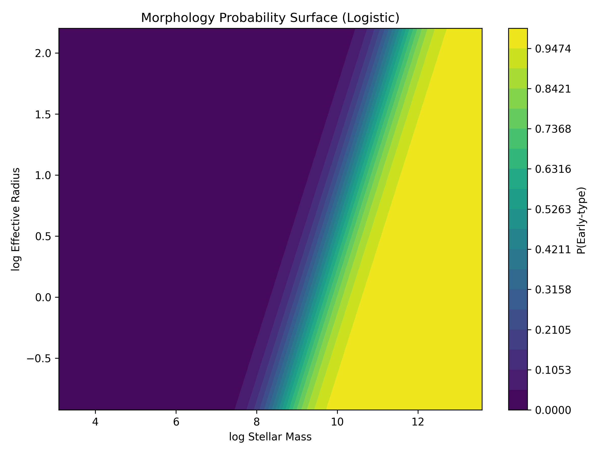
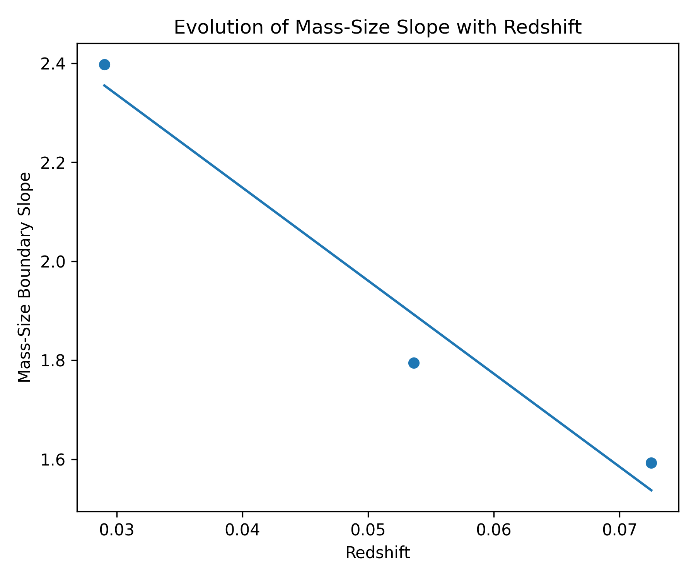

# Galaxy Structure Inference from Mass–Size Geometry (z < 0.08)

**Galaxy morphology in the local universe is quantitatively separable in mass–size space, with a geometric boundary slope ≈ 2 and systematic redshift evolution.**

This repository presents a reproducible, hypothesis-driven study of galaxy structural classification using NASA–Sloan Atlas (NSA) data. By combining interpretable machine learning with geometric boundary analysis, we demonstrate that galaxy morphology correlates with a mass–size scaling relation consistent with a surface-density–like threshold — and that this threshold evolves with redshift.

---

## Key Results

- Linear mass–size boundary slope ≈ **2.01**
- Cross-validation stability: std ≈ **0.003**
- Robust under regularization changes (C = 0.1–10)
- Redshift evolution: slope decreases from ~2.40 (low z) to ~1.59 (high z)
- Logistic Regression ROC-AUC ≈ **0.84**
- Random Forest ROC-AUC ≈ **0.88**

---

## Figures



*Probability surface in log(M\*)–log(Re) space for structural classification. The diagonal transition band confirms that morphology is governed by a mass–size tradeoff, not mass alone.*



*Evolution of the mass–size boundary slope across redshift bins. The systematic decline suggests the morphology transition becomes increasingly compactness-regulated at later cosmic times.*

---

## Scientific Motivation

Galaxy morphology (disk-dominated vs bulge-dominated) is strongly correlated with global structural properties such as stellar mass and effective radius. This project investigates the hypothesis:

> Galaxy structure emerges from multivariate mass–size interaction rather than from a single dominant parameter.

Rather than maximizing classification accuracy, this study emphasizes **geometric interpretability** and **robustness of structural boundaries** as the primary scientific objectives.

---

## Dataset

**Source:** NASA–Sloan Atlas (NSA)  
**Redshift range:** z < 0.08 (conservative reliability cut)  
**Final sample:** ~287,000 galaxies

Extracted quantities:

- Stellar mass (M\*; Sérsic-based, log-transformed)
- Effective radius (Re; Sérsic half-light radius, log-transformed)
- Spectroscopic redshift (z)
- Sérsic index (n) — used **only** to define structural class

Binary structural classification:

- Disk-dominated: n < 2.5
- Bulge-dominated: n ≥ 2.5

The Sérsic index is removed from the feature set to prevent target leakage.

---

## Methodology

### Preprocessing

- FITS ingestion with endian correction
- Conservative redshift filtering (z < 0.08)
- Removal of non-physical entries
- Log-transform of physical scale quantities
- Stratified 80/20 train-test split (class balance preserved)

### Modeling

- **Logistic Regression** — interpretable linear baseline
- **Random Forest** — non-linear comparison
- 5-fold stratified cross-validation throughout
- Permutation importance analysis on test set

### Controlled Feature Experiments

| Experiment | Features | Logistic AUC | RF AUC |
|---|---|---|---|
| Full structural model | M\*, Re, z | 0.840 | 0.877 |
| Remove surface density | M\*, Re, z | 0.840 | 0.877 |
| Compactness only | Σ\*, z | 0.800 | 0.784 |

The compactness-only model underperforms significantly, confirming that morphology depends on the **geometry** of mass–size space, not a single compactness ratio.

---

## Geometric Boundary Analysis

Logistic regression coefficients were extracted to interpret the decision boundary directly.

The boundary in log-space satisfies:

$$R_e = -\frac{\beta_M}{\beta_R} M_* + C$$

Empirically measured:

$$-\frac{\beta_M}{\beta_R} \approx 2.01$$

This implies the morphology transition follows:

$$\log M_* - 2 \log R_e \approx \text{constant}$$

which corresponds to a stellar surface mass density threshold:

$$\log \Sigma_* = \log M_* - 2 \log R_e = \text{constant}$$

This geometric result — slope ≈ 2 — emerged from the model **without explicitly providing surface density as a feature**. The model recovered the compactness scaling from mass and size alone.

### Robustness

| Test | Result |
|---|---|
| CV fold stability | slope = 2.008 ± 0.003 |
| Regularization (C = 0.1) | slope = 2.009 |
| Regularization (C = 1.0) | slope = 2.008 |
| Regularization (C = 10.0) | slope = 2.008 |

The boundary geometry is intrinsic to the data and not a numerical artifact.

---

## Redshift Evolution

The sample was divided into three equal-sized redshift bins (~76,000 galaxies each).

| Redshift Bin | z Range | Slope |
|---|---|---|
| Low z | 0.000 – 0.042 | ~2.40 |
| Mid z | 0.042 – 0.064 | ~1.79 |
| High z | 0.064 – 0.080 | ~1.59 |

Linear fit:

$$\frac{d(\text{slope})}{dz} \approx -18.8$$

The systematic decline indicates the morphology transition becomes increasingly compactness-regulated toward lower redshift. This evolution is not driven by bin size imbalance and persists under all robustness checks.

---

## Interpretation

1. Galaxy morphology is strongly encoded in mass–size geometry.
2. The structural transition approximates a surface-density threshold, recovered geometrically without explicit feature engineering.
3. The boundary is intrinsically stable — insensitive to cross-validation fold, regularization strength, or feature set variations.
4. The structural threshold evolves systematically with redshift, consistent with compactness-driven quenching becoming stronger at late cosmic times.

These results support the hypothesis that galaxy structure emerges from **multivariate physical interaction** rather than from a single linear parameter threshold.

---

## Reproducibility
```bash
pip install -r requirements.txt
python src/data_cleaning.py
python src/split_data.py
python src/train_model.py
```

Raw NSA FITS data is not version-controlled. Place the file in `data/raw/` before running.

---

## Repository Structure
```
galaxy-structure-inference/
│
├── README.md
├── requirements.txt
├── config.yaml
├── src/
│   ├── data_cleaning.py
│   ├── split_data.py
│   └── train_model.py
├── figures/
│   ├── mass_size_probability_surface.png
│   └── slope_vs_redshift.png
└── data/  (not version-controlled)
```

---

## Project Philosophy

This repository emphasizes hypothesis-driven experimentation, strict leakage prevention, geometric interpretability of learned boundaries, and robustness testing over performance maximization. The objective is scientific understanding of structural scaling relations rather than model optimization.

---

## Author

Gnaneshwar G S  
Computational galaxy evolution | Structural scaling relations | Statistical modeling in large survey datasets